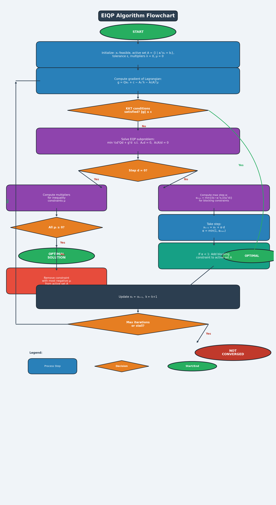

# AI Repository

## EIQP Algorithm — Equality-Inequality Quadratic Programming

The **EIQP (Equality-Inequality Quadratic Programming)** algorithm solves constrained quadratic optimization problems of the form:

$$\min_{x} \; \frac{1}{2} x^T Q x + c^T x$$

subject to:

$$A_e x = b_e \quad \text{(equality constraints)}$$
$$A_i x \leq b_i \quad \text{(inequality constraints)}$$

where **Q** is a positive semi-definite matrix, **c** is a cost vector, and the constraint matrices define feasible regions.

### Key Steps

| Step | Description |
|------|-------------|
| **Initialisation** | Start from a feasible point; build the initial active set *A* of binding inequality constraints |
| **KKT Check** | Evaluate the Lagrangian gradient; if KKT conditions are met, the current point is optimal |
| **EQP Subproblem** | Solve an equality-constrained QP over the current active set to find a search direction *d* |
| **Step Length** | When *d ≠ 0*, compute the maximum step *α* before a new inequality becomes active |
| **Update** | Move to *xₖ₊₁ = xₖ + α·d*; add any blocking constraint to the active set |
| **Multiplier Check** | When *d = 0*, compute Lagrange multipliers; if all *μᵢ ≥ 0* the point is optimal; otherwise drop the constraint with the most negative multiplier and continue |

### Flowchart

The diagram below illustrates the full decision logic of the EIQP algorithm:

