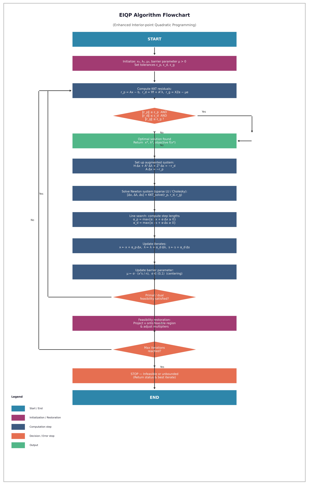

# AI_repository

## EIQP Algorithm Flowchart

The diagram below illustrates the **Enhanced Interior-point Quadratic Programming (EIQP)** algorithm — a primal-dual interior-point method for solving quadratic programs with equality and inequality constraints.

